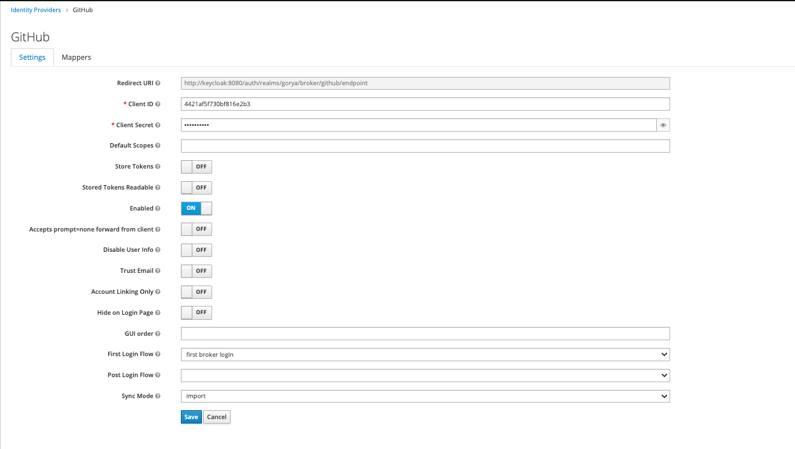

# Gorya

Scheduler for compute instances across clouds. A Golang port of [Doiintl's Zorya](https://github.com/doitintl/zorya).

[](https://raw.githubusercontent.com/nduyphuong/gorya/dev/LICENSE)
[](https://github.com/nduyphuong/gorya/actions)

# Supported Resources
- AWS:
 - [X] EC2
 - [X] RDS
 - [ ] EKS
- GCP:
 - [X] EC2
 - [X] CLOUDSQL
 - [ ] GKE
- AZURE:
 - [X] AZURE VIRTUAL MACHINE
  
## Building Gorya

### Software requirements

-   [go 1.20+]
-   [git]

## Setup your environments

By default, in-mem sqlite is used but MySQL is recommended for production setup.

#### Option 1: Set up with docker-compose
1. Create a new directory for project if not exists.
```bash
mkdir -p ~/go/src/github.com/nduyphuong/gorya
```
2. Clone the source code
```bash
cd ~/go/src/github.com/nduyphuong/gorya
git clone https://github.com/nduyphuong/gorya
```
3. Set up the stack with docker
```bash
cd ~/go/src/github.com/nduyphuong/gorya
docker-compose up -d
```
4. Setup keycloak
#### Client:

Make sure that `Access Type` is `public` and `Web Origins` is `http://localhost:3000` or `*`
#### Roles:
Gorya rely on keycloak for doing identity and access management.
List of role to configure for `gorya` client:
- add-policy
- add-schedule
- delete-policy
- delete-schedule
- get-policy
- get-schedule
- get-timezone
- list-policy
- list-schedule


#### Github:
Create a [github oauth app](https://github.com/settings/developers) for keycloak.

Keycloak github identity provider setting:


```mermaid
sequenceDiagram
autonumber
actor U as User
participant UI as Gorya UI
participant K as Keycloak
participant IDP as Upstream Identity Provider
participant BE as Gorya Backend

U->>UI: Unauthenticated user
UI->>K: Redirects to Keycloak
K->>U: Login page
U->>K: Choose Identity Provider
K->>U: Return Identity Provider login page
U->>IDP: Enter credential
IDP->>UI: Return JWT Token
UI->>UI: Extract access token
UI->>BE: Send request with authorization header
BE->>K: Verify access token, with associated role in keycloak
BE->>UI: Response
```

#### Option 2: Set up with helm

TBD

## How it works

```mermaid
sequenceDiagram
autonumber
actor U as User
participant G as Gorya
participant Q as GoryaQueue
participant P as Gorya Processor
participant C as Cloud Provider APIs

loop Every 60 Minutes
U->>G: Create off time schedule
G->>Q: Dispatch task
end
P->>Q: Process next item
P->>C: Change resource status

```

[go 1.20+]: https://go.dev/doc/install
[git]: https://docs.github.com/en/get-started/quickstart/set-up-git
